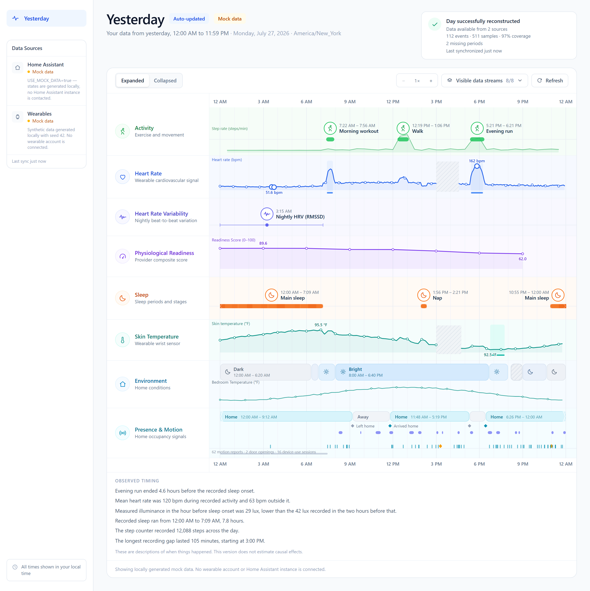
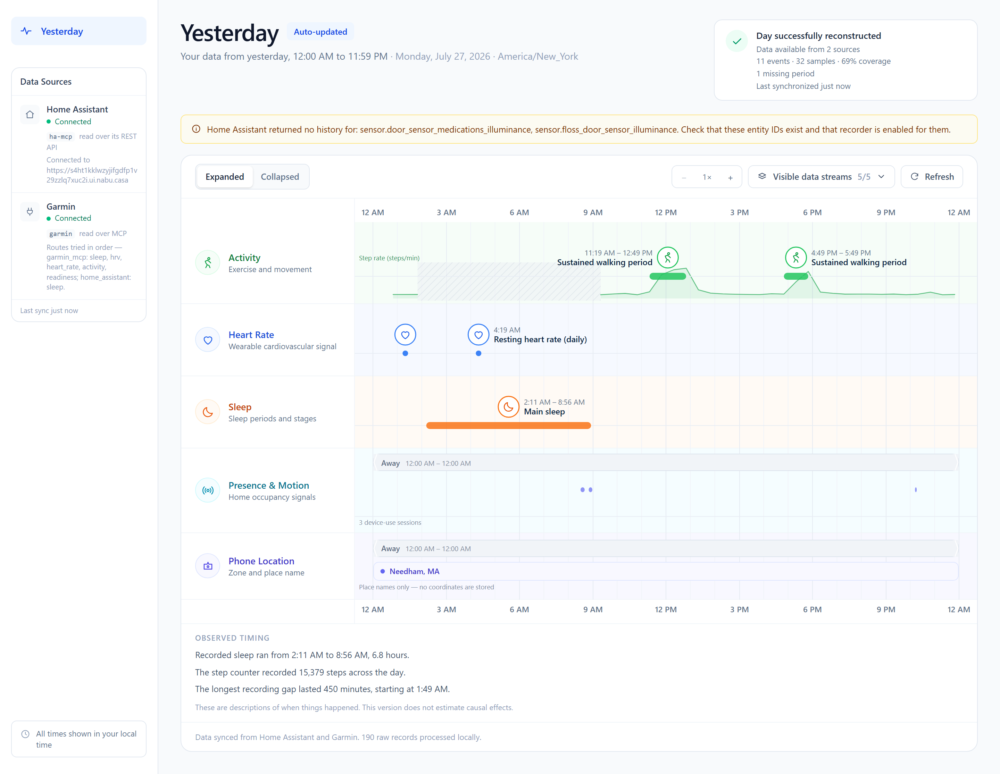
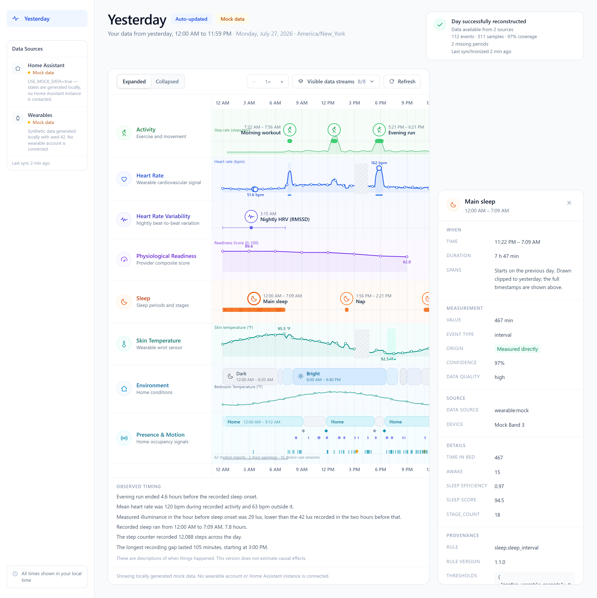
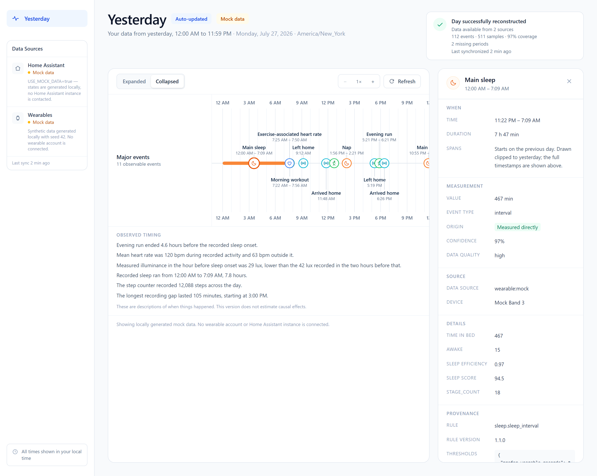
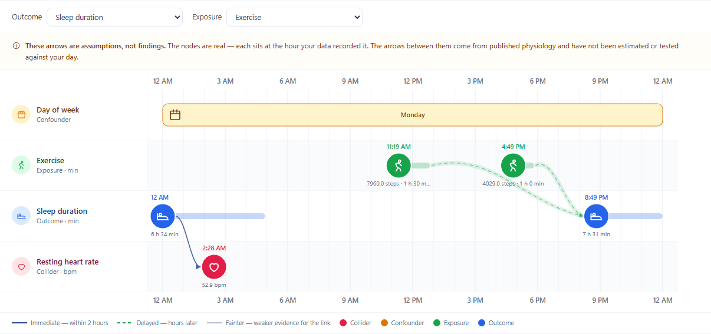

# Yesterday Timeline

An MCP server that reconstructs a local calendar day from Home Assistant and
wearable data, and serves it as an hour-by-hour swimlane timeline on localhost.

It opens on yesterday. A calendar in the sidebar picks any earlier day, which is
fetched and processed on demand.

The page answers one question — *what actually happened yesterday, and how do I
know?* — and every mark on it is clickable down to the raw sensor records
behind it.



<details>
<summary>More screenshots</summary>

**Live Home Assistant data.** Four lanes have data; the other four hide
themselves and say why. The hatched band is a 450-minute stretch where the step
counter stopped reporting — drawn as missing rather than smoothed over.



**Details panel.** Every mark opens its full provenance: which rule produced it,
at which version, with which thresholds, from which raw records.



**Collapsed mode.** The major events of the day on one line — and nothing else.
No arrows, no connections, no implied causality.



**DAG mode.** The same day, with the causal structure you would have to assume
to ask whether exercise affected sleep — placed on the day's own clock. The
nodes are real recorded moments; the arrows are assumptions, and the ones the
day could not place are listed rather than dropped.



</details>

> **This version does not do causal inference.** It visualizes timing and makes
> the day inspectable. It will say "the evening run ended 4.6 hours before the
> recorded sleep onset"; it will never say the run *caused* anything. See
> [No causal claims](#no-causal-claims).

---

## Contents

- [What it does](#what-it-does)
- [Choosing a day](#choosing-a-day)
- [The DAG tab](#the-dag-tab)
- [Quick start (mock data)](#quick-start-mock-data)
- [Architecture](#architecture)
- [Connecting Home Assistant](#connecting-home-assistant)
- [Wearable providers](#wearable-providers)
- [MCP client configuration](#mcp-client-configuration)
- [MCP tools](#mcp-tools)
- [Environment variables](#environment-variables)
- [Starting it automatically at login](#starting-it-automatically-at-login)
- [Developer commands](#developer-commands)
- [Testing](#testing)
- [Where to change things](#where-to-change-things)
- [Privacy model](#privacy-model)
- [No causal claims](#no-causal-claims)
- [Troubleshooting](#troubleshooting)
- [Known limitations](#known-limitations)
- [Future causal-analysis extension points](#future-causal-analysis-extension-points)

---

## What it does

1. **Collects** the previous local calendar day from Home Assistant's history
   API and a wearable provider.
2. **Normalizes** it — unit cleanup, de-duplication, state intervals, counter
   resets, explicit outages.
3. **Engineers interpretable features** with configurable thresholds, each
   carrying full provenance.
4. **Visualizes** the day as aligned swimlanes on one shared time axis.
5. **Makes every event inspectable**, down to the raw records that produced it.

Nothing is invented. A lane with no data hides itself and says why; a stream
that stopped reporting is drawn as a hatched gap rather than a smooth line.

### Arranging the rows

Each row has a handle on hover: drag it, or use the up/down buttons beside it,
and the order is remembered. The saved order is a list of lane ids and is
routinely stale in both directions — a lane vanishes on a day with no data for
it, and a new one appears when a source starts reporting — so a lane that
disappears today and returns tomorrow comes back where you left it, and a lane
you have never arranged joins at the bottom rather than jumping to the top.

### The lanes

| Lane | What it shows | Source |
| --- | --- | --- |
| Activity | Workout sessions, and step rate derived from a cumulative counter | Wearable records, or a Home Assistant step sensor |
| Heart Rate | Continuous heart rate, or a once-a-day resting value when that is all a source publishes | Wearable |
| Heart Rate Variability | One nightly value, attached to the sleep period it summarises | Wearable |
| Physiological Readiness | The provider's own composite score — never relabelled "energy" | Wearable |
| Sleep | Main sleep and naps, with stages when the provider publishes them | Wearable, or bed-occupancy as a documented fallback |
| Skin / Wrist Temperature | Wearable temperature, labelled with the actual measurement | Wearable |
| Environment | Light-condition blocks derived from measured illuminance, plus a room-temperature sub-line | Home Assistant |
| Presence & Motion | Home/away, arrivals and departures, motion, door openings, device-use sessions | Home Assistant |
| Phone Location | The zone a device tracker reported, and the town it geocoded to | Home Assistant |

### Data sources are MCP servers

Every row in the Data Sources panel is an MCP integration you configured — not
an internal abstraction. Each row names the server and states how it is reached,
so the route is never implied:

| Row | MCP server | How it is read |
| --- | --- | --- |
| Home Assistant | `ha-mcp` | Its REST API (faster than proxying history through the MCP server) |
| Garmin | `garmin` | The MCP server itself, read-only `get_*` tools only |

Leave `command` unset under `mcp.servers` and the timeline reuses the server
definition already in your MCP client's configuration, so credentials live in
one place.

**Only read-only tools are ever called.** The Garmin MCP also exposes tools that
create workouts and delete courses; `app/connectors/mcp_client.py` enforces an
allow-list and refuses anything outside it before the call leaves this process.

---

## Collapsed mode

The **Collapsed** tab reduces the day to its major events on one line. Two
controls shape it:

- **Phenotype toggles** switch individual streams in and out, because a busy day
  puts more on one line than one line can hold.
- **1 / 3 / 7 days** widens the window into the days before the selected one,
  scrolling horizontally. The selected day is the rightmost panel and the view
  opens there, with history to its left.

Each day is drawn as its own panel with its own scale rather than laid on one
continuous ruler. A day is 23 or 25 hours across a daylight-saving change, so a
single linear ruler would either misplace the boundaries or silently stretch one
day; a panel per day keeps every day internally exact and makes the boundary
explicit.

**Widening the window never triggers a sync.** Only days the server has already
processed load on their own — reconstructing a new day goes out to Home
Assistant and the wearable MCP and can take the better part of a minute, and
five of those firing because you clicked *7 days* would be a nasty surprise. An
unprocessed day shows a **Fetch this day** button instead.

---

## Choosing a day

The page opens on yesterday — the default and the day the MCP tools describe.
The sidebar calendar selects any other day up to and including today.

| Marker | Meaning |
| --- | --- |
| Filled dot | Already processed, and holds events |
| Hollow ring | Already processed, but nothing was recorded |
| Unmarked | Not fetched yet — selectable, and fetched on demand |

The three states are drawn differently on purpose: "nothing happened that day"
and "nobody has looked at that day" are different facts, and a calendar that
showed them the same way would invite the wrong conclusion.

Days are stored once processed, so revisiting one is instant. A first visit to
an unfetched day takes as long as its sources need — tens of seconds when an
MCP-backed source has to sign in. Future days are never selectable, and today is
labelled *In progress*, because a day still happening is incomplete by
definition.

> Note: the first version of this project deliberately had no date selection.
> The calendar was added later at the owner's request; everything else about the
> single-day design is unchanged, and there is still no trends view, no
> multi-day comparison, and no cross-day aggregation.

---

## Quick start (mock data)

No credentials, no Home Assistant, no wearable account.

```bash
make install
```

```bash
make build && make dev-backend
```

Then open **http://127.0.0.1:8000**.

`USE_MOCK_DATA` defaults to `true`, so the page fills with a deterministic
synthetic day: a main sleep period crossing midnight, three activity sessions,
a heart-rate series with an elevated stretch inside each workout, one nightly
HRV value, a temperature curve, light-condition intervals, home/away intervals,
motion events, and a charging gap where the watch recorded nothing.

The same seed always produces the same day:

```bash
MOCK_DATA_SEED=42
```

### Prerequisites

- **Python 3.12+** — `uv` will install it for you (`uv python install 3.12`)
- **Node.js 18+**
- **[uv](https://docs.astral.sh/uv/)** for the Python environment. Prefer plain
  `pip`? `python -m venv server/.venv && server/.venv/bin/pip install -e "server[dev]"`.

### Two ways to run it

| Mode | Command | URL |
| --- | --- | --- |
| **Built** (one process, one port) | `make build` then `make dev-backend` | `http://127.0.0.1:8000` |
| **Dev servers** (hot reload) | `make dev` | `http://127.0.0.1:3000` |

In dev mode Vite proxies `/api` to the backend, so the browser only ever talks
to one origin.

---

## The DAG tab

Next to **Expanded** and **Collapsed** is **DAG**. Pick an outcome — and
optionally an exposure — and it draws the causal structure you would have to
assume before analysing that question, **laid out on the day's own clock**.

It is one swimlane per variable, on the same x-axis the timeline tab uses, so
the two views line up exactly. A node appears only at an hour the day actually
recorded that event or state.


Two things are on screen at once, and they have very different standing:

- **The nodes are observations.** Each sits at a real recorded time, with its
  own value and duration.
- **The arrows are assumptions.** They come from published physiology in
  `server/app/causal/knowledge.py`. Nothing is fitted, estimated or tested
  against your data, and the page says so in three places: a banner above the
  graph, the closing note, and an `"estimated": false` field that a test
  asserts.

Anchoring the graph in real times buys one piece of discipline — **an arrow is
only drawn when the order in time permits it**, joining each cause to the first
occurrence of its effect that does not precede it — and costs the ability to
draw anything for a variable the day never recorded.

| Encoding | Meaning |
| --- | --- |
| Glyph inside the node | Which variable it is — sleep duration, onset and efficiency share a lane but not an icon |
| Node colour | Its role in the question you asked |
| Outlined instead of filled | Background context, so the nodes with a role stay the ones that catch the eye |
| Solid navy arrow | Immediate — the effect follows within two hours |
| Dashed green arrow | Delayed — the effect appears hours later |
| Fainter line | Weaker published evidence for that link |
| Halo behind an arrow | It lies on the exposure → outcome path |
| Full-width band | A state that held all day, so no single hour owns it |

Roles are still assigned, and still only exist relative to an exposure. The
row label carries each one; the adjustment set, mediator warnings and collider
warnings come back from `get_expected_dag` rather than being printed under the
graph:

| Role | Meaning | What to do with it |
| --- | --- | --- |
| **Confounder** | A common cause of both exposure and outcome | Adjust for it |
| **Mediator** | Sits on the path from exposure to outcome | Do *not* adjust — it absorbs the effect you want |
| **Collider** | A common *effect* of two variables | Do *not* adjust — it manufactures an association |

### What it refuses to draw

Three cases where an arrow would be a lie. The page stays quiet about them —
the graph is the graph — but every one is in the `/api/dag` response and the
`get_expected_dag` MCP tool, under `rows` and `unplacedEdges`:

- **Unmeasured variables** — stress, alcohol, caffeine, illness, work schedule.
  They have no place on a clock at all. They remain part of the assumed
  structure, and the response names which ones you cannot adjust away with the
  sources you have connected.
- **Whole-day states** — the town you were in, an all-day away period. True at
  every hour, so there is no single hour for an arrow to attach to. They get a
  band instead.
- **Continuously sampled signals** with no discrete events, such as a raw heart
  rate trace. Picking a moment out of a continuous line would be inventing
  salience. A derived value like resting heart rate *is* a moment, and does get
  a node.

Give it an outcome alone and it shows what is believed to cause that outcome.
Edit `knowledge.py` to change the hypotheses; `causal/grounding.py` decides how
each variable is recognised on a real day. Both are meant to be edited — a
personal causal model should be personal.

> Like the calendar, this reverses the original spec's "no causal claims"
> constraint, added later at the owner's request. It is scoped so it stays
> defensible: the app proposes *structure* and orders it in time, and still
> estimates nothing. The timeline tabs remain free of causal language, and a
> test asserts that.

---

## Architecture

```
                MCP client (Claude Code, Claude Desktop, ...)
                                  │  stdio
                                  ▼
                        MCP server  (server/app/mcp/)
                                  │  HTTP to localhost
                                  ▼
  ┌───────────────────────── Local API (FastAPI) ─────────────────────────┐
  │                                                                        │
  │  connectors/home_assistant  ──┐                                        │
  │  connectors/wearables       ──┤──▶ normalization ──▶ feature_engineering│
  │                               │         │                    │         │
  │                               ▼         ▼                    ▼         │
  │                        raw records   samples/states     lanes + events  │
  │                               └──────── storage (SQLite) ──────┘        │
  └───────────────────────────────────┬────────────────────────────────────┘
                                      │  GET /api/yesterday
                                      ▼
                        React + TypeScript + SVG interface
```

Layers are strictly separated:

- **Connectors** know about vendors. Nothing else does.
- **Normalization** does unit cleanup and interval closing. No interpretation.
- **Feature engineering** interprets, with thresholds from `config.yaml` and
  provenance on every output.
- **The frontend** draws what it is given. It never decides what is true.

### The shared event schema

`server/app/models/timeline.py` is mirrored by
`frontend/src/types/timeline.ts`. Timestamps are timezone-aware ISO 8601
throughout and are converted to local display time only at render.

```ts
type TimelineEvent = {
  id: string;
  phenotype: string;
  label: string;
  eventType: 'point' | 'interval' | 'continuous';
  startTime: string;
  endTime?: string;
  value?: number | string;
  unit?: string;
  source: string;
  measuredOrDerived: 'measured' | 'derived';
  confidence?: number;
  metadata?: Record<string, unknown>;
  provenance?: {
    rawRecordIds: string[];
    transformationRule?: string;
    ruleVersion?: string;
    thresholds?: Record<string, unknown>;
  };
};
```

### Days are not always 24 hours

Daylight-saving transitions produce 23- and 25-hour days, and in a few zones
local midnight does not exist at all on the spring-forward date.
`server/app/services/day.py` handles both, and the frontend's x-scale divides by
the day's *real* length:

```
x = padLeft + fractionOfDay * drawableWidth
fractionOfDay = elapsedRealTime(dayStart → t) / elapsedRealTime(dayStart → dayEnd)
```

> One trap worth knowing about: subtracting two Python `datetime`s that share a
> `ZoneInfo` uses their *wall-clock* fields, so a 23-hour day silently measures
> as 24. Every duration in this codebase normalizes to UTC first. See
> `services/day.py::elapsed` and `tests/test_day.py`.

---

## Connecting Home Assistant

### 1. Credentials

Create a long-lived access token in Home Assistant (profile → Security → Long-lived
access tokens), then:

```bash
cp .env.example .env
```

```
HOME_ASSISTANT_URL=http://homeassistant.local:8123
HOME_ASSISTANT_TOKEN=<your token>
LOCAL_TIMEZONE=America/New_York
USE_MOCK_DATA=false
```

`.env` is git-ignored. The token is read from the environment only — it is never
written to SQLite, returned by the API, or logged.

### 2. Find your entities

```bash
make discover
```

This lists every entity the timeline can use, grouped by role, and prints a
ready-to-paste `config.yaml` fragment. It never prints your credentials.

### 3. Map them

```bash
cp config.example.yaml config.yaml
```

```yaml
home_assistant:
  entities:
    presence: [person.you]
    motion: [binary_sensor.living_room_motion]
    temperature: [sensor.bedroom_temperature]
    illuminance: [sensor.living_room_illuminance]
    humidity: [sensor.living_room_humidity]
    door: [binary_sensor.front_door]
    device_use: [binary_sensor.phone_interactive]
    steps: [sensor.you_steps]
    resting_heart_rate: [sensor.you_resting_heart_rate]
    sleep: [binary_sensor.bed_occupied]
```

Entity IDs are never hardcoded. Malformed configuration produces a specific
validation error naming the offending key.

### Two things about Home Assistant history that matter

Both were found against a live instance and are handled:

1. **Only the first row of each entity's history carries `entity_id` and
   `attributes`.** Every later row is minimal (`state` + `last_changed`). A
   parser that filters on `entity_id` keeps one sample per entity and silently
   drops the rest.

2. **Home Assistant records state *changes*, not samples.** A sensor that has
   not changed in an hour is steady, not missing. Numeric streams are therefore
   held until `feature_engineering.data_gap.stale_after_minutes` elapses. An
   explicit `unavailable` state is different — that is *known* missing data and
   is always drawn as a gap, however brief.

### Failure handling

The app stays usable when Home Assistant does not. Missing entities, unknown and
unavailable states, duplicate records, sensor gaps, timezone conversion, DST,
histories crossing midnight, authentication failure, an offline instance, rate
limits and partial availability are all handled, and each produces a specific
message rather than a generic error.

---

## Wearable providers

The core application is not coupled to any vendor. Three providers ship today:

| Provider | Use for | Capabilities |
| --- | --- | --- |
| `mock` | Exploring the interface with no credentials | All six metrics |
| `json_file` | Any export you can write to a JSON schema | Whatever the file declares |
| `home_assistant` | A wearable whose data already reaches Home Assistant (Fitbit, Withings, Google Fit) | Sleep only — see below |
| `garmin_mcp` | A Garmin watch, through the Garmin MCP server | Sleep (with stages), HRV, continuous heart rate, activity, Body Battery |
| `auto` | Several routes at once, tried in order per metric | The union of its routes |

### `auto`: several routes at once

Most people have more than one source, and each covers what the other misses.

```yaml
wearable:
  provider: auto
  routes:
    - garmin_mcp       # stages + continuous HR when the watch was worn
    - home_assistant   # the Fitbit daily summary for the nights it was not
```

The merge is per-metric and first-non-empty: for each metric the routes are
asked in order and the first with data supplies it. Metrics are never blended,
so a heart-rate line always comes from one device rather than being stitched
together, and every event keeps its own source and device in the details panel.

Set it in `config.yaml`:

```yaml
wearable:
  provider: json_file
  json_file:
    path: ./data/wearable.json
```

### The `home_assistant` provider

Fitbit-style integrations publish the night's sleep as a handful of once-a-day
sensors rather than a stage-by-stage record:

```yaml
wearable:
  provider: home_assistant
  home_assistant:
    device_name: Fitbit Inspire 3
    sleep:
      start_time: sensor.you_sleep_start_time        # "02:11"
      time_in_bed_minutes: sensor.you_sleep_time_in_bed
      minutes_asleep: sensor.you_sleep_minutes_asleep
      efficiency: sensor.you_sleep_efficiency
```

The provider reconstructs one interval from the clock string plus the duration,
choosing the date that makes the night end at or before the moment the
integration published it — so a 23:30 bedtime reported at 08:00 is correctly
attributed to the previous evening.

It declares **only** `sleep`, because that is all it can honestly serve: a daily
resting heart rate is not a heart-rate curve, so it is handled as its own Home
Assistant stream and drawn as a single labelled point.

### The `garmin_mcp` provider

```yaml
mcp:
  servers:
    garmin:
      discover_from_client: true    # reuse your MCP client's definition
      # or launch it explicitly:
      # command: uvx
      # args: ["--from", "git+https://github.com/Taxuspt/garmin_mcp", "garmin-mcp"]

wearable:
  provider: garmin_mcp
  garmin_mcp:
    mcp_server: garmin
```

This is the richest route: a stage-by-stage hypnogram, two-minute heart rate,
Body Battery as the readiness line, and real activity records. Garmin returns a
`null`-filled envelope for a day it has nothing for — that is a real answer
("the watch wasn't worn"), so the lanes hide themselves rather than erroring.

### Adding a vendor

`server/app/connectors/wearables/registry.py` documents the four steps:

1. Create `server/app/connectors/wearables/<vendor>.py` implementing
   `WearableProvider` — subclass `BaseWearableProvider` and override only the
   metrics the vendor really exposes.
2. Register the factory in `_FACTORIES`.
3. Add the name to the `Literal` in `config/schema.py::WearableConfig`.
4. Document any new environment variables in `.env.example`.

Nothing else changes: capability metadata flows to the frontend automatically,
and lanes without a supporting capability hide themselves.

---

## MCP client configuration

### Claude Code

```bash
claude mcp add yesterday-timeline -- /absolute/path/to/yesterday-timeline/server/.venv/bin/python -m app.mcp.server
```

Or add it to `.mcp.json` in your project:

```json
{
  "mcpServers": {
    "yesterday-timeline": {
      "command": "/absolute/path/to/yesterday-timeline/server/.venv/bin/python",
      "args": ["-m", "app.mcp.server"],
      "cwd": "/absolute/path/to/yesterday-timeline/server"
    }
  }
}
```

### Claude Desktop

`~/Library/Application Support/Claude/claude_desktop_config.json` on macOS, or
`%APPDATA%\Claude\claude_desktop_config.json` on Windows:

```json
{
  "mcpServers": {
    "yesterday-timeline": {
      "command": "C:\\path\\to\\yesterday-timeline\\server\\.venv\\Scripts\\python.exe",
      "args": ["-m", "app.mcp.server"],
      "cwd": "C:\\path\\to\\yesterday-timeline\\server"
    }
  }
}
```

Credentials come from `.env`, so they do not need to appear in the MCP client
configuration. If you prefer to pass them explicitly, add an `env` block.

---

## MCP tools

| Tool | Purpose |
| --- | --- |
| `launch_yesterday_timeline` | Start the backend and frontend if they are not running; return the URL. Idempotent. |
| `sync_yesterday_data` | Fetch and process the previous local calendar day. Returns counts, coverage, warnings, errors. |
| `get_yesterday_timeline` | Return the normalized timeline. Supports lane filtering, downsampling, and toggling metadata/provenance. |
| `get_day_timeline` | Return the timeline for one specific day (`YYYY-MM-DD`). |
| `list_days` | List the days the calendar can offer, and which already hold data. |
| `get_expected_dag` | Build the expected causal graph for an outcome (and optional exposure). A hypothesis, never an estimate. |
| `list_causal_variables` | List variables usable as an exposure or outcome, and whether each was observed. |

Edge edits made in the UI are stored server-side, so `get_expected_dag` reflects
them too.
| `get_data_sources` | Status and capabilities of every configured source. |
| `get_event_details` | Complete metadata and provenance for one event id. |
| `refresh_timeline` | Re-run synchronization and feature engineering. |
| `open_timeline` | Open the URL in the default browser, or return it if that is not possible. |

```json
{ "status": "running", "url": "http://127.0.0.1:8000", "backend_url": "http://127.0.0.1:8000" }
```

The tools deliberately do not stream the whole dataset through the model:
`get_yesterday_timeline` returns a lane summary by default, and the localhost
frontend fetches processed data straight from the local API.

### Local API

FastAPI serves OpenAPI documentation at `http://127.0.0.1:8000/docs`.

```
GET    /api/health              GET    /api/yesterday
GET    /api/config              POST   /api/yesterday/sync
GET    /api/data-sources        GET    /api/day/{date}
GET    /api/days                POST   /api/day/{date}/sync
GET    /api/lane-config         GET    /api/events/{event_id}
PATCH  /api/lane-config         GET    /api/raw-records/{record_id}
GET    /api/dag/variables       DELETE /api/cache
POST   /api/dag
```

`/api/yesterday` is an alias for `/api/day/{yesterday}`; both return the same
payload. A future date is refused with a `future_date` error rather than an
empty day.

---

## Environment variables

| Variable | Default | Purpose |
| --- | --- | --- |
| `LOCAL_TIMEZONE` | `America/New_York` | IANA zone used to decide which day "yesterday" was |
| `USE_MOCK_DATA` | `true` | `false` reads real sources |
| `MOCK_DATA_SEED` | `42` | Makes the mock day reproducible |
| `WEARABLE_PROVIDER` | *(config.yaml)* | Overrides the configured provider |
| `HOME_ASSISTANT_URL` | — | e.g. `http://homeassistant.local:8123` |
| `HOME_ASSISTANT_TOKEN` | — | Long-lived access token |
| `HOME_ASSISTANT_TIMEOUT_SECONDS` | `15` | Request timeout |
| `HOME_ASSISTANT_VERIFY_SSL` | `true` | Only disable for a self-signed cert on your own network |
| `API_HOST` / `API_PORT` | `127.0.0.1` / `8000` | Backend bind address |
| `FRONTEND_PORT` | `3000` | Vite dev server port |
| `DATA_DIR` | `./data` | Where the SQLite file lives |
| `CONFIG_PATH` | *(auto)* | `config.yaml`, falling back to `config.example.yaml` |

---

## Starting it automatically at login

One command registers a Windows Scheduled Task that starts the server, pulls
yesterday, and opens the page every time you sign in:

```powershell
.\scripts\install_autostart.ps1
```

```powershell
.\scripts\install_autostart.ps1 -Status
```

```powershell
.\scripts\install_autostart.ps1 -Uninstall
```

It runs as your user at your login, 30 seconds after sign-in
(`-DelaySeconds` changes that), with no elevation and no console window. The
task waits for a network connection first, because Home Assistant is reached
over one — a machine that signs in before Wi-Fi associates would otherwise
record a failed fetch.

| Script | What it does |
| --- | --- |
| `scripts/install_autostart.ps1` | Registers, inspects or removes the login task |
| `scripts/start_on_login.ps1` | What the task runs: start, pre-fetch, open. Safe to run by hand |
| `scripts/stop.ps1` | Stops the server |

`start_on_login.ps1` is idempotent — if something already answers on port 8000
it reuses it rather than starting a second server. A failed fetch is logged and
the page still opens; a source that was down is not a reason to show nothing.

Progress goes to `logs/startup.log`, one block per login:

```
2026-07-30 10:22:26  --- login trigger ---
2026-07-30 10:22:39  Server is up.
2026-07-30 10:22:40  Ready: 2026-07-29 - 18 events, 85% coverage, 1225 raw records.
```

`scripts/stop.ps1` finds the server by **who owns the port**, not by process
name. A `uv`-created virtualenv has a trampoline `python.exe` that re-execs the
real interpreter, so the process actually holding port 8000 is a child of the
one the launcher started — stopping the parent alone would leave the server
running.

### Days synced while they were still running

Opening the page on a day still in progress caches a partial snapshot of it.
Once that day ends, the snapshot is no longer a valid answer, so `get_or_sync`
compares each cached day's generation time against the day's own end and
re-fetches anything captured early.

The check deliberately fires only *after* a day is over. Today always looks
partial by that definition, and the page polls every minute — re-fetching on
each poll would spawn and authenticate a Garmin MCP subprocess every time.
Today stays cached; **Refresh** is how you ask for its latest hours.

---

## Developer commands

```bash
make help
```

| Command | What it does |
| --- | --- |
| `make install` | Install backend and frontend dependencies |
| `make dev` | Start the backend API and the frontend dev server together |
| `make build` | Build the frontend so the backend serves it on one port |
| `make sync` | Fetch and process yesterday from the configured sources |
| `make open` | Open the timeline in the default browser |
| `make discover` | List Home Assistant entities and print a config fragment |
| `make test` | Backend and frontend unit tests |
| `make test-e2e` | Playwright end-to-end suite (needs a running app) |
| `make clean-data` | Delete every locally cached record |

Direct equivalents, if you would rather not use `make`:

```bash
cd server && .venv/bin/python -m uvicorn app.main:app --host 127.0.0.1 --port 8000 --reload
```

```bash
cd frontend && npm run dev
```

### Docker (optional, not required)

```bash
docker compose up --build
```

Builds the frontend, serves it from the backend, and publishes only to
`127.0.0.1:8000`.

---

## Testing

```bash
make test
```

**Backend** (pytest) covers previous-day calculation, timezone handling and DST
transitions, event normalization, sleep crossing midnight, missing values, Home
Assistant API parsing, feature-engineering provenance, mock provider determinism,
MCP tool responses, partial-source failure, and the real-world Home Assistant
regressions described above.

**Frontend** (vitest) covers timeline rendering, lane alignment, lane visibility,
the collapsed/expanded toggle, event selection, the details panel, missing-data
gaps, source-error states, and zoom.

**End-to-end** (Playwright) drives the whole workflow: load the Yesterday page,
confirm lanes render on a shared axis, click an event, confirm the details panel,
inspect raw data, switch to collapsed mode and back, hide and restore a lane,
refresh, and check that no causal or judgemental language appears anywhere.

```bash
cd frontend && npm run test:e2e:install   # once
```

---

## Where to change things

| To change... | Edit |
| --- | --- |
| Any threshold | `config.yaml` → `feature_engineering:` |
| Light categories | `config.yaml` → `feature_engineering.light_category.thresholds` |
| **Workout detection** | `server/app/feature_engineering/rules/activity.py` |
| **Sleep intervals** | `server/app/feature_engineering/rules/sleep.py` |
| **Elevated heart rate / baselines** | `server/app/feature_engineering/rules/heart_rate.py` |
| **HRV handling** | `server/app/feature_engineering/rules/hrv.py` |
| **Readiness** | `server/app/feature_engineering/rules/readiness.py` |
| **Temperature deviation** | `server/app/feature_engineering/rules/temperature.py` |
| **Light categories / environment** | `server/app/feature_engineering/rules/light.py` |
| **Presence, motion, doors, device use** | `server/app/feature_engineering/rules/presence.py` |
| Lane order and failure handling | `server/app/feature_engineering/pipeline.py` |
| Config schema for a new rule | `server/app/config/schema.py` |
| **Add a wearable provider** | `server/app/connectors/wearables/registry.py` + a new module beside it |
| Home Assistant entity groups | `server/app/config/schema.py::HomeAssistantEntities` and `connectors/home_assistant/connector.py::STREAM_BY_DOMAIN` |
| The calendar and its markers | `frontend/src/components/Calendar.tsx` |
| Which days are offered | `server/app/services/sync.py::available_days` |
| Lane colours, heights, major events | `frontend/src/utilities/lanes.ts` |
| The x-axis scale | `frontend/src/timeline/scale.ts` |

---

## Privacy model

- **All processing is local.** No personal sensor data is transmitted anywhere.
- The server binds to `127.0.0.1` by default, and CORS is restricted to the
  local frontend origin.
- Secrets live in environment variables only. The token is never stored in
  SQLite, returned by the API, or written to logs.
- **No geographic coordinates** are read or emitted, including in the Phone
  Location lane. Home Assistant puts `latitude`, `longitude` and `gps_accuracy`
  in device-tracker attributes; the connector keeps only the state string, so
  they never enter the data model at all. A test walks the serialised lane and
  fails if any field carries one.
- **Location is shown at town level by default.** The lane draws the tracker's
  zone (`Home`, `Away`, or a named zone) and the town from a geocoded sensor.
  The full street address is off unless you deliberately set
  `feature_engineering.phone_location.include_street_address: true`, and each
  event records that the choice was made.
- **MCP calls are read-only.** The client enforces a per-server allow-list of
  `get_*` tools and refuses anything else before it leaves the process.
- Locally cached data lives in one SQLite file at `$DATA_DIR/yesterday.sqlite3`.
  Raw records are retained for 90 days so that personal baselines can span more
  than one day.

```bash
make clean-data          # or: curl -X DELETE http://127.0.0.1:8000/api/cache
```

---

## No causal claims

This version is a temporal visualization and feature-engineering application. It
lays the foundation for later N-of-1 causal analysis by making the observed day
understandable, without claiming causality now.

The DAG tab proposes causal *structure* — which arrows you would have to
assume — and is labelled as a hypothesis throughout. No effect is estimated
anywhere in this app.

On the timeline itself, it **will** say:

> Evening run ended 4.6 hours before the recorded sleep onset.
> Mean heart rate was 120 bpm during recorded activity and 63 bpm outside it.
> Measured illuminance in the hour before sleep onset was 28 lux, lower than the
> 41 lux recorded in the two hours before that.

It will **not** say that exercise improved sleep, that bright light increased
energy, or that heart rate represented stress. There are no causal arrows, no
delayed-effect edges, and no recommendations.

It is equally careful about labels. Elevated heart rate is reported relative to
your own observed baseline — "1.8 standard deviations above the 30-day personal
baseline" — never as an anxiety, stress or panic event, and never as clinically
abnormal. A wrist sensor reports skin temperature, not core body temperature. A
vendor readiness score is called physiological readiness, not energy. And the
status card reports coverage and counts; it never tells you that you had a good
day.

Automated tests assert that no causal or judgemental language appears on the
timeline tabs, and that the DAG payload always reports `estimated: false` and
never carries a p-value, effect size or coefficient.

---

## Troubleshooting

**The page says the local backend is not running.**
Start it with `make dev-backend`, or call the `launch_yesterday_timeline` MCP
tool. Check `http://127.0.0.1:8000/api/health`.

**"Home Assistant could not be reached at the configured URL."**
Check `HOME_ASSISTANT_URL` in `.env` and that the instance is up. Wearable lanes
still render — the app degrades per-source, not globally.

**"Home Assistant rejected the access token."**
Long-lived tokens are revoked when the issuing user's password changes. Create a
new one and update `HOME_ASSISTANT_TOKEN`.

**"Home Assistant returned no history for: sensor.x"**
The entity does not exist, or `recorder` is not enabled for it. Check the ID with
`make discover`, and confirm it is not excluded in your recorder configuration.

**A lane I expected is hidden.**
Open *Visible data streams* — unavailable lanes are listed there with the exact
reason. Most often the provider does not publish that metric, or nothing was
recorded during the day.

**The step or environment line has a hatched gap.**
The source genuinely stopped reporting for longer than
`feature_engineering.data_gap.stale_after_minutes`. Raise that value for sensors
that legitimately report rarely.

**A whole day shows as "Away".**
Home Assistant's `person` entity was `not_home` for the day. Set
`feature_engineering.home_presence.entity_priority` to prefer a tracker that
actually updates.

**The wrong day is shown.**
`LOCAL_TIMEZONE` overrides `config.yaml`. Confirm with
`http://127.0.0.1:8000/api/config`.

**Port 8000 or 3000 is in use.**
Set `API_PORT` / `FRONTEND_PORT` in `.env`.

---

## Known limitations

- **One day at a time.** The calendar picks *which* day; it never compares two.
  There is no trends view and no cross-day aggregation.
- **The DAG is a prior, not a finding.** Its arrows encode published
  physiology, not anything learned from your data. Placing them on the clock
  checks only that an assumed effect is *ordered* correctly in time — it does
  not test whether the effect occurred. Estimating the effects it proposes
  would need many days, which this version does not do.
- **A first visit to an unfetched day is slow.** It has to sign in to the
  sources and read the whole day — tens of seconds when Garmin is involved.
  Processed days are stored, so returning to one is instant.
- **How far back you can go depends on the sources**, not on this app: Home
  Assistant's `recorder` retention (10 days by default) and whatever history
  your wearable account holds.
- **Sleep stages depend on the provider.** The `home_assistant` provider gets
  daily summaries, so it reports an interval with no stages rather than
  inventing a hypnogram.
- **Step-derived activity is smeared by sync interval.** A counter that syncs
  every 30 minutes locates movement to within 30 minutes, and the rule says so
  in each event's provenance. It never names an exercise type from cadence.
- **Personal baselines need history.** With fewer than 30 stored samples the
  rules fall back to a same-day baseline and label it as such in the details
  panel.
- **No live push.** The page polls the local API every 60 seconds; the Refresh
  control is immediate.
- **Vendor APIs are not implemented.** Oura, Fitbit, Garmin, Apple Health and
  Health Connect are documented extension points, not shipped clients. The only
  real integrations that exist and have been tested are Home Assistant's REST
  API and the wearable-via-Home-Assistant provider.

---

## Future causal-analysis extension points

The data model is built so that a later version can add multiple-day comparison,
lagged associations, candidate causal edges, N-of-1 estimation, confidence
intervals, intervention comparison and user-defined phenotypes — without
reshaping anything.

- Raw records are retained for 90 days and keyed by day, so multi-day queries
  need no schema change (`storage/repository.py`).
- `Repository.compute_baselines` already computes personal baselines across a
  configurable window; it generalises to lagged windows.
- Every derived feature carries `transformationRule`, `ruleVersion` and its
  thresholds, so a future analysis can filter to features produced by a known
  rule version.
- `TimelineEvent` and `TimelineSeries` are day-scoped by convention, not by
  structure — nothing prevents a range query returning the same types.
- `feature_engineering/pipeline.py` runs independent, individually failing
  rules; an association or estimation stage would be added after it, never
  inside it.

None of that is implemented, and no inactive UI controls hint at it.
