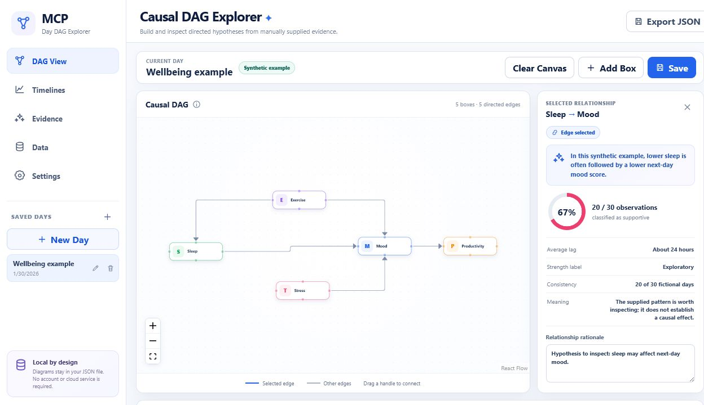
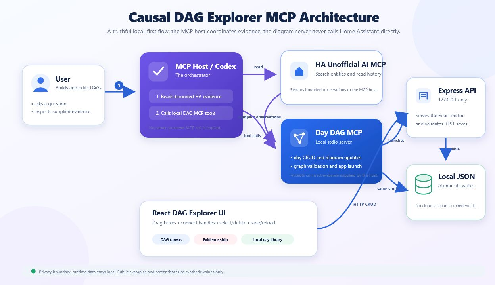

# Causal DAG Explorer MCP

[](https://github.com/resace3/causal-dag-explorer-mcp/actions/workflows/ci.yml)

A local-first MCP server and React website for manually building, inspecting, and saving directed acyclic graphs (DAGs) for custom days. It combines Lucidchart-like box editing with optional, explicitly supplied evidence summaries. It does not perform causal inference or invent missing observations.



## What it does

- Creates, renames, switches, and deletes multiple saved days.
- Adds rounded rectangular boxes with four visible connection handles.
- Renames boxes by double-clicking or using the edit control.
- Drags boxes and automatically preserves their coordinates.
- Draws arrowed directed edges from any box handle to another.
- Supports branching and merging: many outgoing edges and many incoming edges.
- Rejects self-edges, duplicate source-target pairs, missing endpoints, and directed cycles.
- Selects boxes or edges and deletes them with Delete or Backspace.
- Shows a relationship inspector with an editable rationale and supplied evidence metadata.
- Shows aligned timelines, a day-pattern strip, hourly drill-down, descriptive summaries, and provenance notes when those bounded values were explicitly supplied.
- Saves to one local JSON file using atomic replacement and restores the exact graph after restart.
- Supports Save, Ctrl+S, or Command+S and shows an unsaved-changes indicator.
- Exports the current day as JSON.

The repository includes a fully synthetic five-node example. It contains no personal Home Assistant data.

## Architecture



The MCP host is the orchestrator. If Home Assistant evidence is requested, the host reads it through HA Unofficial AI and then passes bounded summaries to this local MCP. The Day DAG MCP never connects to Home Assistant or another MCP directly.

The editable architecture source is [docs/architecture.svg](docs/architecture.svg).

## Requirements

- Node.js 20 or newer
- pnpm 10 or newer
- A desktop browser

## Install and run

```bash
git clone https://github.com/resace3/causal-dag-explorer-mcp.git
cd causal-dag-explorer-mcp
corepack enable
pnpm install --frozen-lockfile
pnpm build
pnpm start
```

Open [http://127.0.0.1:3000](http://127.0.0.1:3000).

The first launch starts with an empty local store. To copy the public synthetic example into the runtime store:

```bash
pnpm seed:example
pnpm start
```

`seed:example` refuses to overwrite an existing `data/days.json`. Use `pnpm seed:example -- --force` only when you intentionally want to replace that local file.

For development:

```bash
pnpm dev
```

Vite serves the UI at `http://127.0.0.1:5173` and proxies API calls to the Express server on port 3000.

## MCP configuration

Build once, then register the stdio server in your MCP client. Replace the placeholder with the absolute path to your clone.

```json
{
  "mcpServers": {
    "causal-dag-explorer": {
      "command": "node",
      "args": [
        "/absolute/path/to/causal-dag-explorer-mcp/dist/node/mcp/index.js"
      ],
      "cwd": "/absolute/path/to/causal-dag-explorer-mcp"
    }
  }
}
```

### MCP tools

| Tool | Purpose |
|---|---|
| `launch_day_diagram_app` | Starts and health-checks the localhost website. |
| `create_day` | Creates an empty saved day. |
| `list_days` | Lists saved day metadata. |
| `get_day` | Reads boxes, edges, and compact evidence for one day. |
| `save_day` | Validates and saves a complete day. |
| `update_day_diagram` | Replaces only the boxes and edges of a day. |
| `create_dag_from_ha_evidence` | Saves a DAG from compact HA evidence already collected by the MCP host. |
| `delete_day` | Deletes one saved day. |

Each tool has a strict JSON schema. Invalid labels, handles, endpoints, duplicate relationships, and cycles return structured errors.

## Website controls

- Use `New Day` to create a separate diagram.
- Click `Add Box` or double-click blank canvas space to add a box.
- Double-click a box to rename it.
- Drag a box to move it.
- Drag from any handle to a handle on another box to create a directed edge.
- Click a box or arrow and press Delete or Backspace to remove it.
- Select an arrow to edit its rationale and inspect any supplied evidence.
- Use `Clear Canvas`; the app asks for confirmation before clearing.
- Use `Save`, Ctrl+S, or Command+S to persist labels, edges, rationales, and coordinates.
- Use the left navigation to open DAG, timeline, evidence, data, and settings views.

## Home Assistant evidence boundary

`create_dag_from_ha_evidence` is intentionally an import tool:

1. An MCP host searches and reads relevant entities through HA Unofficial AI.
2. The host compacts the observations into labels, summaries, optional aligned day/hour values, and limitations.
3. The host calls this MCP with that bounded payload.
4. This server validates the DAG and saves it locally.
5. The user inspects and edits the result manually.

Only supplied summaries are displayed. The app does not:

- query Home Assistant itself;
- store Home Assistant credentials;
- copy raw API payloads;
- infer causal effects;
- calculate p-values or model fit;
- fill missing series with generated values.

Arrows are editable hypotheses for exploration, not proof of causation.

## Local data

Runtime data is stored in `data/days.json`, which is intentionally ignored by Git. The tracked `data/example-days.json` is synthetic.

Set these optional environment variables:

| Variable | Default | Purpose |
|---|---|---|
| `DAY_DIAGRAM_PORT` | `3000` | Local web-server port. |
| `DAY_DIAGRAM_DATA_FILE` | `data/days.json` | Alternate local JSON store. |
| `DAY_DIAGRAM_WEB_ORIGIN` | disabled | Optional CORS origin for Vite development. |

Writes use a temporary file followed by an atomic rename.

## Validation and tests

```bash
pnpm typecheck
pnpm test:unit
pnpm build
pnpm test:mcp
pnpm test:release
pnpm exec playwright install chromium
pnpm test:e2e
```

The automated coverage includes:

- JSON store create/list/get/save/rename/delete and restart restoration;
- exact label, position, connection-handle, rationale, and evidence persistence;
- five-node branching and merging DAGs;
- rejection of self, duplicate, cyclic, malformed, and missing-endpoint edges;
- REST API persistence;
- MCP tool names and JSON schemas;
- a real stdio MCP client calling app launch and every data tool;
- public example validation and privacy checks;
- real browser creation and rename of five boxes;
- real pointer dragging and handle-to-handle edge drawing;
- edge selection/deletion, invalid-edge UI messages, save, hard reload, day switching, clear confirmation, and deletion;
- evidence inspector, timeline, day-pattern, descriptive-summary, data, and settings views.

GitHub Actions runs type checking, unit tests, a production build, release/privacy checks, and the Chromium browser suite on every push and pull request.

## Project structure

```text
src/
  mcp/       MCP tool contracts, dispatcher, and launcher
  server/    Express API and static website
  storage/   Atomic local JSON persistence
  web/       React and React Flow explorer
  shared/    Types, validation, graph rules, evidence import
tests/       Unit and API tests
e2e/         Playwright browser tests
docs/        Public-safe UI and architecture images
data/        Synthetic example; runtime file is ignored
```

## License

MIT
